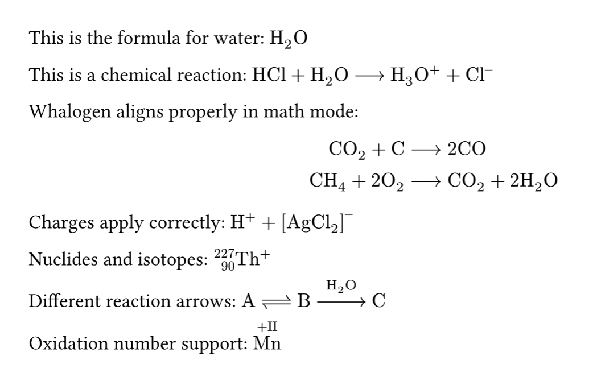

<div align="center">

[](https://typst.app/universe/package/whalogen)
[](https://github.com/schang412/typst-whalogen/blob/master/LICENSE)
[](https://raw.githubusercontent.com/schang412/typst-whalogen/master/manual.pdf)

</div>

# Whalogen

Whalogen is a library for typsetting chemical formulae and reactions with Typst, inspired by mhchem.

## Usage
```typst
#import "@preview/whalogen:0.3.0": ce

This is the formula for water: #ce("H2O")
This is a chemical reaction: #ce("HCl + H2O -> H3O+ + Cl-")
Whalogen aligns properly in math mode:
$
#ce("CO2 + C &-> 2CO")\
#ce("CH4 + 2O2 &-> CO2 + 2H2O")
$
Charges apply correctly: #ce("H+ + [AgCl2]-")
Nuclides and isotopes: #ce("@Th,227,90@^+")
Different reaction arrows: #ce("A <=> B ->[H2O] C")
Oxidation number support: #ce("|Mn,+II|")

```




See the [manual](manual.pdf) for more details and examples.
